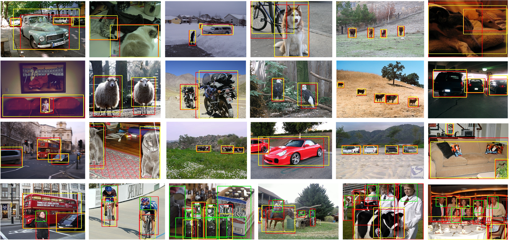

# FI-WSOD: Foreground Information Guided Weakly Supervised Object Detection

This is the official PyTorch implementation of FI-WSOD (2022 TMM). [[**PDF**]](https://ieeexplore.ieee.org/document/9854139) 

This implementation can achieve the performance of **56.4% mAP** and  **72.4% CorLoc** on VOC2007 dataset.


> **FI-WSOD: Foreground Information Guided Weakly Supervised Object Detection  (IEEE Transactions on Multimedia)** \
> Yufei Yin, Jiajun Deng, Wengang Zhou, Li Li, and Houqiang Li.





# Installation
Check [INSTALL.md](https://github.com/Yinyf0804/FI-WSOD/blob/main/INSTALL.md) for installation instructions.

# Datasets
Check [DATASETS.md](https://github.com/Yinyf0804/FI-WSOD/blob/main/DATASETS.md) for installation instructions.

# Model Zoo
Check [MODEL_ZOO.md](https://github.com/Yinyf0804/FI-WSOD/blob/main/MODEL_ZOO.md) for installation instructions.
Pretrained model needs to be downloaded.

The final structure of data/ are as follows:
  ```bash
  data/
  data/pretrained_model/
  data/selective_search_data/
  data/VOC2007/
  ```


# Training

**Train** a FI-WSOD network on VOC2007 (Only support single-gpu training). 

  ```bash
  CUDA_VISIBLE_DEVICES=0 python tools/train_net_step.py --dataset voc2007 \
    --cfg configs/vgg16_voc2007_fiwsod.yaml --bs 1 --nw 4 --iter_size 4
  ```

# Inference
 **Test** a FI-WSOD network on VOC2007 (Only support single-gpu testing). 
 
    
 ### Test on test split with mAP:
 ```bash
  python tools/test_net.py --cfg configs/vgg16_voc2007_fiwsod.yaml \
    --load_ckpt $MODEL_PATH \
    --dataset voc2007test
    
  # (Optional)
  python tools/reeval.py $TEST_DIR/detections.pkl \
    --dataset voc2007test --cfg configs/vgg16_voc2007_fiwsod.yaml
  ```
    
 ### Test on trainval split with CorLoc:
 ```bash
  python tools/test_net.py --cfg configs/vgg16_voc2007_fiwsod.yaml \
    --load_ckpt $MODEL_PATH \
    --dataset voc2007trainval

  python tools/reeval.py $TEST_DIR/discovery.pkl \
    --dataset voc2007trainval --cfg configs/vgg16_voc2007_fiwsod.yaml \
    --style corloc
  ```
  
  ### Default directory (models & test results):
  ```bash
  $OUTPUT_DIR = output/fiwsod/
  $CONFIG_NAME = vgg16_voc2007_fiwsod
  $MODEL_NAME = model_step39999.pth
  $STEP = model_step39999
  $MODEL_PATH = $OUTPUT_DIR/$CONFIG_NAME/ckpt/$MODEL_NAME
  $TEST_DIR = $OUTPUT_DIR/$CONFIG_NAME/test/$STEP
  ```
  You can change them in [configs/vgg16_voc2007_fiwsod.yaml](https://github.com/Yinyf0804/FI-WSOD/blob/main/configs/vgg16_voc2007_fiwsod.yaml)
  
# Citation

If you find this code useful for your research, please use the following BibTeX entry.

```
@article{yin2022fi,
  title={FI-WSOD: Foreground Information Guided Weakly Supervised Object Detection},
  author={Yin, Yufei and Deng, Jiajun and Zhou, Wengang and Li, Li and Li, Houqiang},
  journal={IEEE Transactions on Multimedia},
  year={2022},
  publisher={IEEE}
}
```

# Acknowledgement
The codes are based on [PCL](https://github.com/ppengtang/pcl.pytorch/tree/0.4.0). Thanks for the wonderful work!
